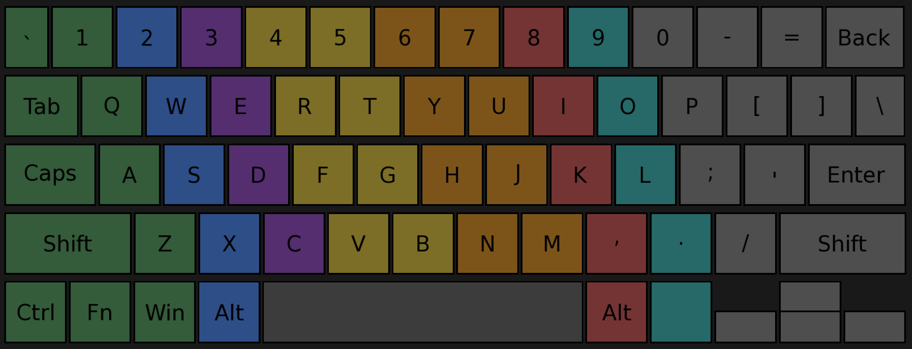

# KeyCoach

A simple keystroke visualizer **guiding you** on which finger to use for which key.

---

## Info

The program uses a **QWERTY laptop layout**. The code is an AI-generated mess, so feel free to improve it. I made this as a **tool to learn** for myself. It’s very simple and it works.

---

## Keyboard Layout

---

## Practice

The **ASDF** and **JKL;** are your homerow keys. Index fingers on **F** and **J**. Don't try to continually rest your fingers on them while typing. Just understand this.
**Hover** your fingers and start tapping keys. **Create the connection between colors and their appointed finger. Get comfertable pressing all keys.**
Then if you're comfortable **start thinking of letters and then pressing them quickly** with the correct finger. This is to get your fast reactive muscle memory good also.
If you're able to do all this comfortably you basically completed this program. **This program is for creating the correct muscle memory** from where you can then learn to type fast.
